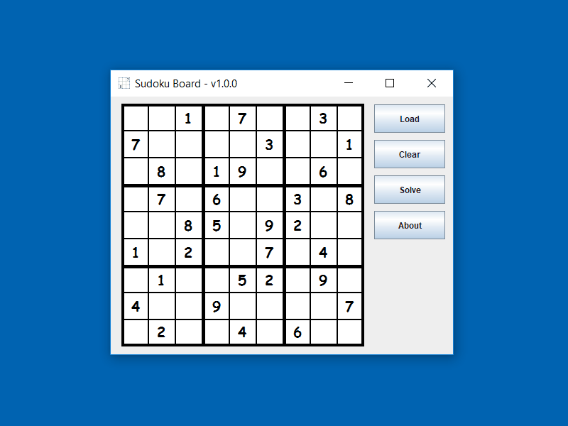

# Sudoku
A Sudoku game that uses Computer Vision and Neural Networks for loading Sudoku to the Sudoku board. When tired of playing Sudoku, solve it by consulting Prolog.


## Topics

- [Sudoku Board v1.0.0](#sudoku-board-v100)
- [Building this Project](#building-this-project)
  - [Prerequisites](#prerequisites)
  - [Building Source](#building-source)
- [Playing the Game](#playing-the-game)
- [Libraries](#libraries)
- [Installing Prerequisites](#installing-prerequisites)


## Sudoku Board v1.0.0




The Sudoku board is built using Java AWT and Swing components.

- **Load** - lets user select an image to load a Sudoku
- **Clear** - clears user set values in Sudoku
- **Solve** - solves the Sudoku from the current state of Sudoku
- **About** - short description of the board game project


Currently it has been built and tested on following systems :
- **Windows (x86-64 bit)**
- **Linux (x86-64 bit)**


## Building this Project

This project can be built from source on **Windows** and **Linux** systems running on **x86-64 bit** machines. Currently there is no binary provided for this project but its libraries are compiled for the mentioned systems. For building the project one needs to have some of the programs installed in their system. After installing these prerequisites (or if it is already installed), one can proceed to build the project.

### Prerequisites

The following programs should be installed before building the source. One can follow the [instructions](#installing-prerequisites) at the end of this page for installing these prerequisites.
- **Java 1.8.x (JDK)**
- **Apache Ant 1.9.x**

__Note__ - One should be able to work with lower version of Apache Ant but this project has been tested with Apache Ant 1.9.x

### Building Source

This project has been tested by building on **Windows\_x86\_64** and **Linux\_x86\_64** machines. Based on the system follow the instructions.

#### Windows\_x86\_64

For building this on a Windows system

- Open command line and move to the **Sudoku** project folder

```
cd <PATH_TO_PROJECT>
```

For example

```
cd "C:\Users\MyAccount\Downloads\NeuralCollection"
```

- Create jar from **build.xml** using ant

```
ant -f build.xml jar
```

This should return a *BUILD SUCCESSFUL* message. One can proceed further after getting this message.

- To play the game move to the newly created **Sudoku** folder inside **build** folder. This **Sudoku** folder contains **Sudoku.jar**, **run.bat** etc.

```
cd build\Sudoku
```
- Run the batch file **run.bat**
```
run.bat
```


---

###### Alternative to run.bat

The batch file **run.bat** adds path to libraries that are used by *Sudoku.jar*. As an alternative to running **run.bat**, one can add libraries to the path and run Sudoku.jar by using the following commands in the built **Sudoku** folder

```
set PATH=%PATH%;lib/opencv-3.2.0;lib/swipl-7.4.2/libs;lib/swipl-7.4.2;lib/neuroph2.93
```
```
java -Xms100m -Xmx400m -jar Sudoku.jar
```

---


__Note__ - After building the project one can move the newly created **Sudoku** folder (**Sudoku** folder inside **build** folder) anywhere. This folder is self-contained and has its dependencies inside it.


#### Linux\_x86\_64

For building this on a Linux system
- Open command line and move to the **Sudoku** project folder

```sh
cd <PATH_TO_PROJECT>
```

For example

```sh
cd "~/Downloads/NeuralCollection/Sudoku/"
```

- Create jar from **build.xml** using ant

```sh
ant -f build.xml jar
```

This should return a *BUILD SUCCESSFUL* message. One can proceed further after getting this message.

- To play the game move to the newly created **Sudoku** folder inside **build** folder. This **Sudoku** folder contains **Sudoku.jar**, **run.sh** etc.

```sh
cd build/Sudoku/
```

- Change permission of run script **run.sh** and run it

```sh
chmod u+x run.sh
```
```sh
./run.sh
```


---

###### Alternative to run.sh

The script file **run.sh** adds path to libraries, makes SWI Prolog binary executable (since unzip task of ant build script does not preserve the permissions) and runs *Sudoku.jar*. As an alternative to running **run.sh**, one can run following commands :

- Add library paths to `$LD_LIBRARY_PATH`

```sh
# use absolute path as SWI Prolog (apart from Sudoku) also uses this path
export LD_LIBRARY_PATH="$LD_LIBRARY_PATH:$PWD/lib/opencv-3.2.0:$PWD/lib/swipl-7.4.2:$PWD/lib/neuroph2.93"
```

- Make SWI Prolog binary executable and add binary path to `$PATH`

```sh
chmod u+x lib/swipl-7.4.2/bin/swipl

# add SWI Prolog binary path to $PATH
export PATH="$PATH:lib/swipl-7.4.2/bin"
```

- Run Sudoku jar

```sh
java -Xms100m -Xmx400m -jar Sudoku.jar
```

---


__Note__ - After building the project one can move the newly created **Sudoku** folder (**Sudoku** folder inside **build** folder) anywhere. This folder is self-contained and has its dependencies inside it (it has indirect dependencies like c/c++ libraries that were used to build dependent dynamic libraries but these indirect dependencies are very basic and most system definitely have it).


## Playing the Game

After building the project, one would get a **Sudoku** folder inside **build** folder of the project. This **Sudoku** folder contains **Sudoku.jar**, script file, libraries and other requirements for playing the game.

<pre>
For starting the game run the <b>run script</b> (<b>run.bat</b> or <b>run.sh</b>) after building the project
</pre>

Also look at alternatives to running scripts ( [Windows](#alternative-to-runbat) or [Linux](#alternative-to-runsh) ).


## Libraries

Third party libraries that are used in this project are listed below. These libraries have been added to the **lib** directory for supported OS (Windows\_x86\_64 and Linux\_x86\_64). There is no need to install these libraries separately.

- OpenCV-3.2.0    ( http://www.opencv.org )

- Neuroph-2.93    ( http://neuroph.sourceforge.net )

- SWI Prolog-7.4.2    ( http://swi-prolog.org )


## Installing Prerequisites

#### Windows\_x86\_64

Below are short description of installing prerequisites on a Windows system.

##### Java SDK 1.8.x

- Download Java JDK  from http://www.oracle.com/technetwork/java/javase/downloads/index.html
- Add the path of the bin folder of installed JDK to the **PATH** environment variable as described here - http://docs.oracle.com/javase/8/docs/technotes/guides/install/windows_jdk_install.html#BABGDJFH

##### Apache Ant 1.9.x

- Download *apache-ant-1.9.x-bin.zip* file from http://ant.apache.org/bindownload.cgi
- Extract the zip to a suitable place or to "*C:/Program Files/Apache Ant*"
- Add the path of bin folder of the extracted zip (example - "*C:/Program Files/Apache Ant/apache-ant-1.9.x/bin*") to **PATH** environment variable

If there is problem installing Apache Ant, follow the detailed installation instructions here - http://ant.apache.org/manual-1.9.x/index.html


#### Linux\_x86\_64

Here are short description of installing prerequisites on a Linux machine using *apt* package manager.

Before going for installation of prerequisites, it is recommended to do an update by executing

```sh
sudo apt-get update
```

##### Java SDK 1.8.x

To install Java type the following command in a terminal

```sh
sudo apt-get install openjdk-8-jdk
```

This would install OpenJDK java which is different from Oracle java but would work for us.

##### Apache Ant

The simplest way to install the latest Ant is to type the following command in a terminal

```sh
sudo apt-get install ant
```

This would install the latest Ant. As of now, on most of the Linux systems, this would be Apache Ant 1.9.x and would work for us.
